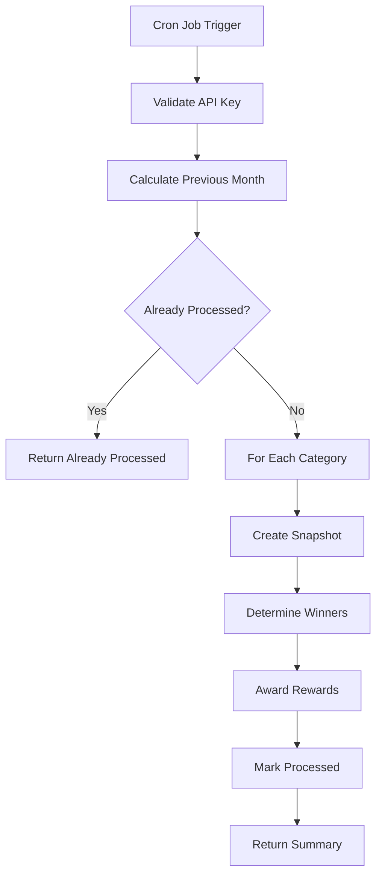

# Monthly Rewards System - Server Documentation

## 🎯 Overview

This document provides technical documentation for the Monthly Rewards & Badges system implementation on the server side.

## 📦 Models

### MonthlyRankingSnapshot

**Location**: `server/models/MonthlyRankingSnapshot.js`

Stores monthly ranking snapshots for historical records and verification.

**Schema**:
```javascript
{
  month: Number (1-12),
  year: Number,
  category: String ('global' | 'students' | 'teachers'),
  rankings: [{
    userId: ObjectId,
    rank: Number,
    score: Number,
    userName: String,
    userEmail: String,
    role: String
  }],
  totalUsers: Number,
  snapshotDate: Date,
  processed: Boolean,
  processedAt: Date
}
```

**Indexes**:
- `{ year: 1, month: 1, category: 1 }` (unique)
- `{ processed: 1, year: 1, month: 1 }`

**Static Methods**:
- `findByMonth(month, year, category)` - Find snapshot for specific month/category
- `findUnprocessed()` - Find all unprocessed snapshots

---

### MonthlyReward

**Location**: `server/models/MonthlyReward.js`

Tracks monthly reward distribution for transparency and auditing.

**Schema**:
```javascript
{
  month: Number,
  year: Number,
  category: String ('global' | 'students' | 'teachers'),
  userId: ObjectId,
  rank: Number,
  tier: String ('CHAMPION' | 'ELITE' | 'ACHIEVER' | 'PERFORMER'),
  coinsAwarded: Number,
  badgeAwarded: String,
  snapshotId: ObjectId,
  status: String ('pending' | 'awarded' | 'failed'),
  errorMessage: String,
  awardedAt: Date
}
```

**Indexes**:
- `{ userId: 1, year: 1, month: 1 }`
- `{ year: 1, month: 1, category: 1, tier: 1 }`
- `{ status: 1, year: 1, month: 1 }`

**Static Methods**:
- `findByUser(userId, limit)` - Get user's reward history
- `findByMonth(month, year, category)` - Get all rewards for a month/category
- `findPending()` - Find all pending rewards

---

### User Model - Badges Array

**Location**: `server/models/User.js`

Badges are stored in the User model's badges array.

**Schema Addition**:
```javascript
badges: [{
  name: String,           // "Monthly Champion"
  category: String,       // "students" | "teachers"
  month: Number,          // 1-12
  year: Number,           // 2024+
  tier: String,           // "CHAMPION" | "ELITE" | "ACHIEVER" | "PERFORMER"
  rank: Number,           // 1-100
  earnedAt: Date          // Timestamp
}]
```

## 🎮 Controllers

### monthlyRewardsController.js

**Location**: `server/controllers/monthlyRewardsController.js`

#### `processMonthlyRewards(req, res)`

Main function to process monthly rewards. Called by cron job.

**Flow**:
1. Validate API key
2. Calculate previous month
3. Check if already processed
4. Process each category (students, teachers)
5. Return summary

**Error Handling**:
- Continues processing other categories if one fails
- Logs errors for each failed reward
- Returns error summary in response

#### `getUserRewardHistory(req, res)`

Retrieves authenticated user's monthly reward history.

**Features**:
- Requires authentication
- Paginated results
- Sorted by date (newest first)

## 🛣️ Routes

**Location**: `server/routes/ranking.js`

### POST `/api/ranking/monthly-rewards`
- **Auth**: API Key (X-API-Key header)
- **Controller**: `processMonthlyRewards`
- **Purpose**: Process monthly rewards (cron job)

### GET `/api/ranking/monthly-rewards/history`
- **Auth**: JWT Bearer Token
- **Controller**: `getUserRewardHistory`
- **Purpose**: Get user's reward history

## ⚙️ Configuration

### Environment Variables

```env
MONTHLY_REWARDS_API_KEY=your-secure-api-key-here
```

### Constants

**Location**: `server/constants/rewards.js`

```javascript
MONTHLY_RANKING_REWARDS: {
  CHAMPION: { coins: 1000, badge: 'Monthly Champion' },
  ELITE: { coins: 500, badge: 'Monthly Elite' },
  ACHIEVER: { coins: 200, badge: 'Monthly Achiever' },
  PERFORMER: { coins: 100, badge: 'Monthly Performer' }
}
```

## 🔄 Processing Flow



## 📊 Database Queries

### Create Snapshot
```javascript
const leaderboard = await User.getLeaderboard(category, 100);
const snapshot = await MonthlyRankingSnapshot.create({
  month, year, category,
  rankings: [...],
  totalUsers: leaderboard.length
});
```

### Award Rewards
```javascript
// Update user
user.rewards.coins += coins;
user.badges.push({...});
await user.save();

// Create reward record
await MonthlyReward.create({
  month, year, category, userId,
  rank, tier, coinsAwarded, badgeAwarded,
  snapshotId, status: 'awarded'
});
```

## 🧪 Testing

### Manual Test
```bash
curl -X POST http://localhost:8080/api/ranking/monthly-rewards \
  -H "X-API-Key: test-key" \
  -H "Content-Type: application/json"
```

### Expected Behavior
1. Creates snapshots for students and teachers
2. Awards rewards to top 100 users per category
3. Returns summary with statistics
4. Idempotent - won't process same month twice

## 🔍 Monitoring

### Logs to Monitor
- `[MonthlyRewards] Processing rewards for X/YYYY`
- `[MonthlyRewards] Snapshot created: <id>`
- `[MonthlyRewards] Awarded <TIER> to user <id>`
- Any error messages

### Key Metrics
- Processing time
- Number of rewards awarded
- Total coins distributed
- Failed rewards (if any)

## 📝 See Also

- [Monthly Rewards & Badges Specification](../../../docs/specs/monthly-rewards-and-badges.md)
- [Cron Setup Guide](../deployment/monthly-rewards-cron-setup.md)
- [Rewards Constants](../../constants/rewards.js)

---

**Last Updated**: January 2025

